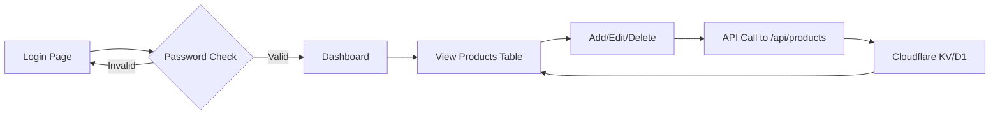

# Captain Games Store – متجر ألعاب الكابتن

A modern gaming store showcase website built with Astro and Tailwind CSS, optimized for Cloudflare Pages deployment.


## 🎮 Features

- **Modern Gaming UI**: Dark theme with neon accents, smooth animations, and immersive design
- **Responsive Design**: Mobile-first approach, works on all screen sizes
- **Fast Performance**: Static-first architecture with Astro
- **Admin Dashboard**: Password-protected CRUD interface
- **Cloudflare Ready**: Zero-config deployment with Pages Functions

## 🛠️ Tech Stack

- **Framework**: [Astro](https://astro.build/) v5
- **Styling**: [Tailwind CSS](https://tailwindcss.com/) v4
- **Fonts**: Orbitron (headings) + Inter (body)
- **Deployment**: Cloudflare Pages
- **API**: Cloudflare Pages Functions
- **Data**: JSON (local) → Cloudflare KV/D1 (production)

## 📁 Project Structure

```
captain-games-store/
├── src/
│   ├── components/        # Reusable UI components
│   │   ├── Hero.astro
│   │   ├── Navbar.astro
│   │   ├── Footer.astro
│   │   └── ProductCard.astro
│   ├── layouts/           # Page layouts
│   │   └── Layout.astro
│   ├── pages/             # Route pages
│   │   ├── index.astro    # Home page
│   │   ├── catalog.astro  # Product catalog
│   │   └── admin/
│   │       └── index.astro # Admin dashboard
│   ├── data/              # Product data (JSON)
│   │   ├── products.json
│   │   └── categories.json
│   └── styles/
│       └── global.css     # Global styles & theme
├── functions/             # Cloudflare Pages Functions
│   └── api/
│       └── products/
│           └── [[path]].js
├── public/                # Static assets
├── astro.config.mjs
├── tailwind.config.mjs
└── package.json
```

## 🚀 Getting Started

### Prerequisites

- Node.js 18+ 
- npm or pnpm

### Installation

```bash
# Clone or navigate to project
cd captain-games-store

# Install dependencies
npm install

# Start development server
npm run dev
```

Visit `http://localhost:4321` to see the site.

### Available Scripts

| Command | Description |
|---------|-------------|
| `npm run dev` | Start dev server on port 4321 |
| `npm run build` | Build for production |
| `npm run preview` | Preview production build |

## 📄 Pages

### Home Page (`/`)
- Full-width hero with bilingual branding
- Featured products grid
- Category showcase
- About section with features
- Newsletter signup

### Catalog Page (`/catalog`)
- Responsive product grid
- Category filtering via URL params
- Client-side search
- Sticky filter bar

### Admin Dashboard (`/admin`)
- Password-protected (demo: `admin123`)
- Product management table
- Add/Edit/Delete modals
- Responsive design

## 🎨 Design System

### Colors

| Token | Value | Usage |
|-------|-------|-------|
| `--color-primary` | `#7c3aed` | Buttons, links, accents |
| `--color-secondary` | `#06b6d4` | Secondary accents |
| `--color-accent` | `#ec4899` | Highlights, badges |
| `--color-dark-800` | `#0d0d14` | Main background |
| `--color-dark-700` | `#12121a` | Card backgrounds |

### Typography

- **Headings**: Orbitron (gaming display font)
- **Body**: Inter (readable system font)

### Responsive Breakpoints

- Mobile: < 640px (1 column)
- Tablet: 768px (2-3 columns)
- Desktop: 1024px+ (4 columns)

## ☁️ Deployment to Cloudflare Pages

### Option 1: GitHub Integration (Recommended)

1. Push code to GitHub repository
2. Go to [Cloudflare Dashboard](https://dash.cloudflare.com/)
3. Navigate to **Workers & Pages** → **Create**
4. Select **Connect to Git**
5. Choose your repository
6. Configure build settings:
   - **Framework preset**: Astro
   - **Build command**: `npm run build`
   - **Build output directory**: `dist`
7. Deploy!

### Option 2: Direct Upload

```bash
# Build the project
npm run build

# Install Wrangler CLI
npm install -g wrangler

# Login to Cloudflare
wrangler login

# Deploy
wrangler pages deploy dist --project-name=captain-games-store
```

### Environment Variables

For production with Cloudflare KV:

```toml
# wrangler.toml
[[kv_namespaces]]
binding = "PRODUCTS_KV"
id = "your-kv-namespace-id"
```

## 🔐 Admin CRUD Flow



### API Endpoints

| Method | Endpoint | Description |
|--------|----------|-------------|
| GET | `/api/products` | List all products |
| GET | `/api/products/:id` | Get single product |
| POST | `/api/products` | Create product |
| PUT | `/api/products/:id` | Update product |
| DELETE | `/api/products/:id` | Delete product |

## 🔮 Future Scalability

### Authentication
- Migrate to [Cloudflare Access](https://www.cloudflare.com/products/zero-trust/access/) for enterprise-grade auth
- Implement JWT tokens with Cloudflare Workers

### Payments
- Integrate Stripe Checkout
- Add PayPal support

### Content Management
- Connect to headless CMS (Sanity, Strapi)
- Use Cloudflare D1 for structured data

### Internationalization
- Full Arabic/English language toggle
- RTL layout support

### Analytics
- Add Cloudflare Web Analytics
- Implement product view tracking

## 📝 License

MIT License - feel free to use for personal or commercial projects.

---

Built with ❤️ for gamers by Captain Games Store
